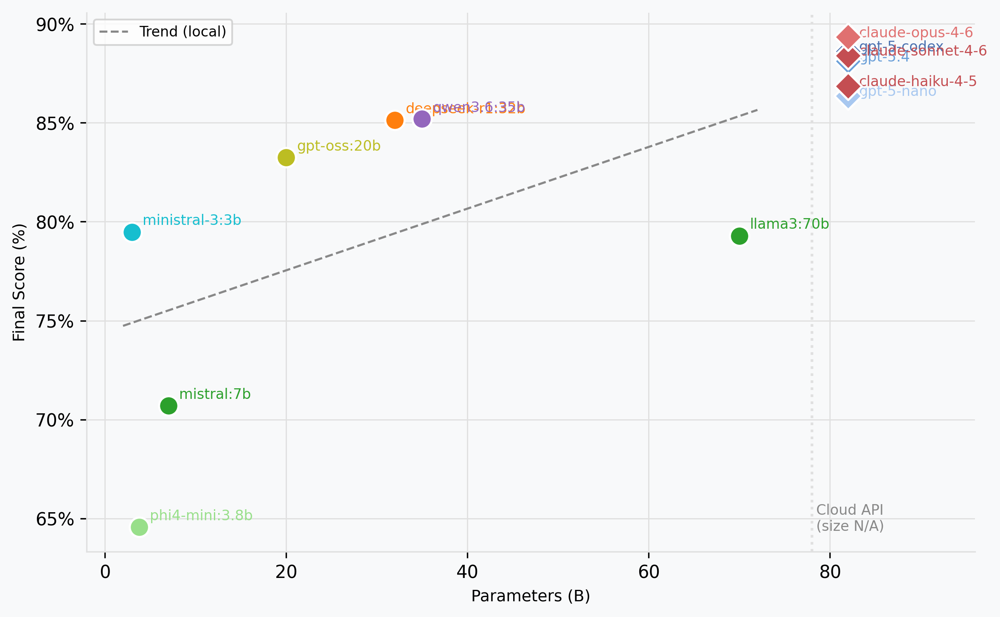

# LLM Code Benchmark Suite

A modular benchmark suite for evaluating LLMs on software engineering tasks across multiple dimensions (correctness, security, performance, and more).

## Benchmark Results

| Model Name | Provider | Total Parameters | Final Score |
|---|---|---|---|
| claude-opus-4.6 | Anthropic | undisclosed | 89.33% |
| claude-sonnet-4.6 | Anthropic | undisclosed | 88.40% |
| gpt-5-codex | OpenAI | undisclosed | 88.62% |
| gpt-5.4 | OpenAI | undisclosed | 88.11% |
| claude-haiku-4.6 | Anthropic | undisclosed | 86.85% |
| gpt-5-nano | OpenAI | undisclosed | 86.36% |
| deepseek-r1 | Ollama | 32B | 85.13% |
| qwen3.6 | Ollama | 35B | 85.20% |
| gpt-oss | Ollama | 20B | 83.24% |
| ministral-3 | Ollama | 3B | 79.48% |
| llama3 | Ollama | 70B | 79.29% |
| mistral | Ollama | 7B | 70.70% |
| phi4-mini | Ollama | 3.8B | 64.56% |



---

## Quickstart

### 1. Install dependencies

```bash
python -m venv venv
# Windows
venv\Scripts\activate
# macOS / Linux
source venv/bin/activate

pip install -r requirements.txt
```

### 2. Set API keys

```bash
# OpenAI
export OPENAI_API_KEY=sk-...

# Anthropic
export ANTHROPIC_API_KEY=sk-ant-...
```

For Ollama, ensure the server is running locally (`ollama serve`). No API key needed.

### 3. Create a config file

```yaml
# config/model_config.yaml
provider: anthropic           # openai | anthropic | ollama | huggingface
model_name: claude-sonnet-4-6
api_key:                      # leave blank to use env var
base_url:                     # leave blank for provider default
temperature: 0.7
max_tokens: 1024
system_prompt:                # optional

run_name: my_run
language: python              # python | cpp | javascript
target_language: javascript   # used by translation task
output_dir: reports/outputs/python
dataset_limit: 10             # rows per task; omit or null for all
pass_threshold: 0.5
num_samples: 1                # >1 enables pass@k estimation
pass_k_values: [1, 5, 10]
```

---

## Running Experiments

### Interactive mode

```bash
python run_experiment.py
```

Guided prompts for provider, model name, API key, tasks, and output settings.

### Non-interactive mode

```bash
python run_experiment.py --yes
```

Reads all values from `config/model_config.yaml` without prompts.

### CLI options

| Flag | Description |
|------|-------------|
| `--config PATH` | Path to YAML config (default: `config/model_config.yaml`) |
| `--yes` / `-y` | Skip all interactive prompts |
| `--tasks TASK ...` | Run specific tasks only |
| `--limit N` | Cap dataset rows per task |
| `--output-dir DIR` | Override output directory |
| `--num-samples N` | Samples per problem for pass@k |
| `--pass-k K ...` | k values for pass@k (e.g. `1 5 10`) |

### Examples

```bash
# Run all tasks non-interactively
python run_experiment.py --yes

# Run bug_fixing and refactoring, limit to 20 rows each
python run_experiment.py --yes --tasks bug_fixing refactoring --limit 20

# Custom config, custom output folder
python run_experiment.py --config config/gpt5.yaml --yes --output-dir reports/gpt5

# Estimate pass@1, pass@5, pass@10 with 10 samples per problem
python run_experiment.py --yes --num-samples 10 --pass-k 1 5 10
```

---

## Available Tasks

| Task | Description |
|------|-------------|
| `bug_fixing` | Fix buggy code given the error or blindly |
| `code_generation` | Generate functions from docstrings or test cases |
| `code_review` | Identify issues in a code snippet |
| `refactoring` | Restructure code while preserving behavior |
| `test_generation` | Generate pytest test suites |
| `translation` | Translate code between languages |

---

## Output

Results are saved as JSON to the configured `output_dir`:

```
reports/outputs/python/
└── 20250420_143012_my_run.json
```

The JSON contains metadata, model config (API key redacted), per-task scores, and per-record results.

---

## Architecture

```
Provider  ──>  Benchmark  ──> Dimension(s)
(who runs)    (what + how)      (how we score)
```

```
codebase/
├── run_experiment.py        # Headless CLI runner
├── main.py                  # TUI entry point
├── config/                  # YAML configs
├── core/                    # Base classes, registry, suite orchestrator
├── providers/               # openai / anthropic / ollama / huggingface
├── benchmarks/
│   ├── tasks/               # One benchmark per task type
│   ├── dimensions/          # One scorer per quality dimension
│   └── matrix.py            # Task × Dimension mapping
├── datasets/                # Input code samples
├── prompts/                 # Prompt templates per task
├── reports/                 # JSON exporters and Jinja templates
├── tui/                     # Textual TUI app
└── utils/                   # Logging, retry, code utilities
```

